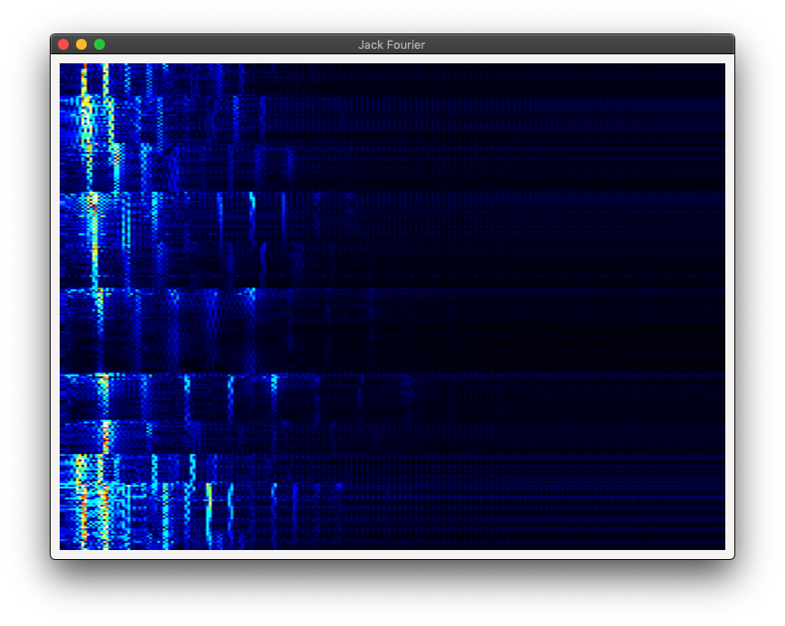

Jack Fourier
============

Spectrogram for jack using gtk in rust.

Extremely unpolished!



# Compiling and running

You need a fairly new rustc & cargo to build this app. To build, simply run:

```sh
$ cargo build
```

And then to start it:

```sh
$ cargo run
```

If you don't have a recent enough versions installed, you might get the following error during the build:

```sh
error: use of unstable library feature 'thread_local_state': state querying was recently added (see issue #27716)
   --> /home/xkr47/.cargo/registry/src/github.com-1ecc6299db9ec823/fragile-0.3.0/src/sticky.rs:100:27
    |
100 |         unsafe { REGISTRY.try_with(|registry| (*registry.get()).0.contains_key(&self.item_id)).unwrap_or(false) }
    |                           ^^^^^^^^

error: aborting due to previous error

error: Could not compile `fragile`.
warning: build failed, waiting for other jobs to finish...
error: build failed
```

In that case one way to fix the problem is to uninstall the cargo & rustc you have and deploy a more recent version with the help of e.g. https://rustup.rs/ and then retry the installation command above.
